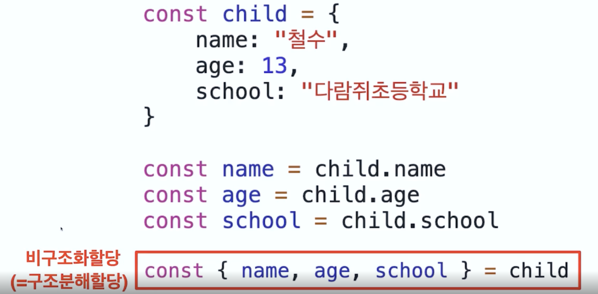

   
객체의 구조분해할당은 위와같이

배열의 구조분해할당은 위와같이   

다음 예제 꼭 풀어보기

    const child = {
        name: '하니',
        age: 30,
        school: '지리산 고등학교'
    }

1. 크롬 웹브라우저에서 위 변수를 선언하시오.
2. child의 age를 비구조화 할당 해보세요.
3. console.log(age)를 출력해보세요

    function getSinger() {
        return {
            name: "미연",
            age: 26,
            group: "여자 아이들"
        }
    }

4. group을 비구조와 할당 해보시고 console.log(group)을 출력해보세요   

    function getClassmates() {
        return [
            child1 : "영희",
            child2 : "철수"
        ]
    }

    const [child1, child2] = getClassmates()   
